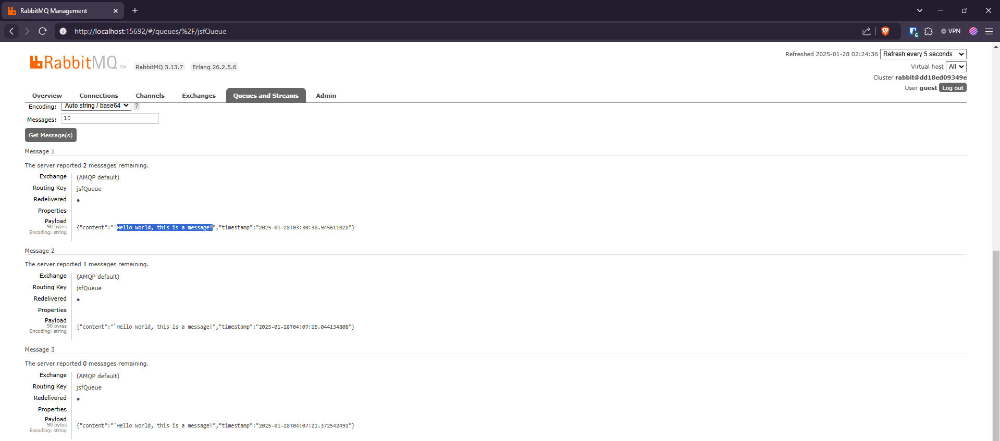

# Java JSF RabbitMQ Docker Demo

## About the Author
Hi! I'm Rodrigo Dantas, a Software Engineer. 
Check my LinkedIn profile<br><a>https://www.linkedin.com/in/dantas-rodrigo/</a>

This project demonstrates my coding style and architecture approach using:

- Java Server Faces (JSF)
- RabbitMQ Message Broker
- Docker Containerization
- Maven Build System

## Project Overview
This demo showcases a containerized JSF application with RabbitMQ messaging integration, emphasizing:

- Clean code practices
- Docker development environment
- Message queue architecture
- Containerized development workflow

## Technologies
- Java 17
- JSF Framework
- RabbitMQ 3.x
- Docker & Docker Compose
- Maven 3.8

## Evidences





## Quick Start 
```bash
# Build and run all services
docker-compose up --build -d

# Check logs
docker-compose logs -f
```

## Quick Start
```bash
# Build and run all services
docker-compose up --build -d

# Check logs
docker-compose logs -f
```

## Service Management
```bash
# Start individual services
docker-compose up producer -d
docker-compose up consumer -d
docker-compose up rabbitmq -d

# Check status
docker-compose ps

# View specific logs
docker-compose logs producer -f
docker-compose logs consumer -f
docker-compose logs rabbitmq -f
```

## Troubleshooting
```bash
# Restart services
docker-compose restart

# Clean up
docker-compose down -v
docker system prune -a

# Check container details
docker ps -a
docker stats
```

## Access Points
- Producer UI: http://localhost:8080
- Consumer UI: http://localhost:8081 
- RabbitMQ Management: http://localhost:15672
  - Username: guest
  - Password: guest